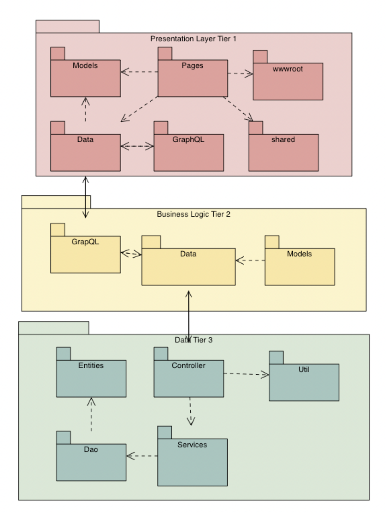
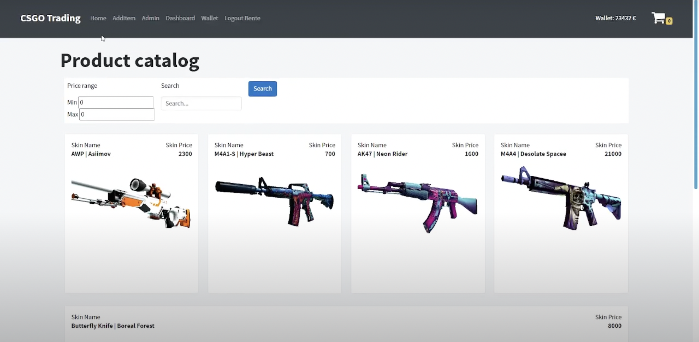

# CSGO-TRADING 
3-Tier distributed CSGO Trading system built with Blazor, C# ASP.NET Core + REST + GraphQL + Java Spring + Hot Chocolate + Strawberry Shake + Graph.ArgumentValidator + Blazored.Toast + Postgresql

# 3-Tier Application

- Presentation Tier (Tier 1)
https://github.com/k-tourist/CSGO-Trading 

# - Video

 
